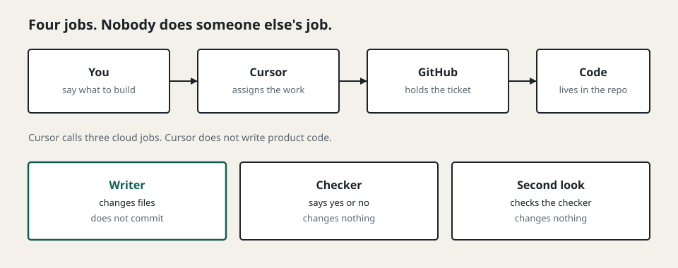
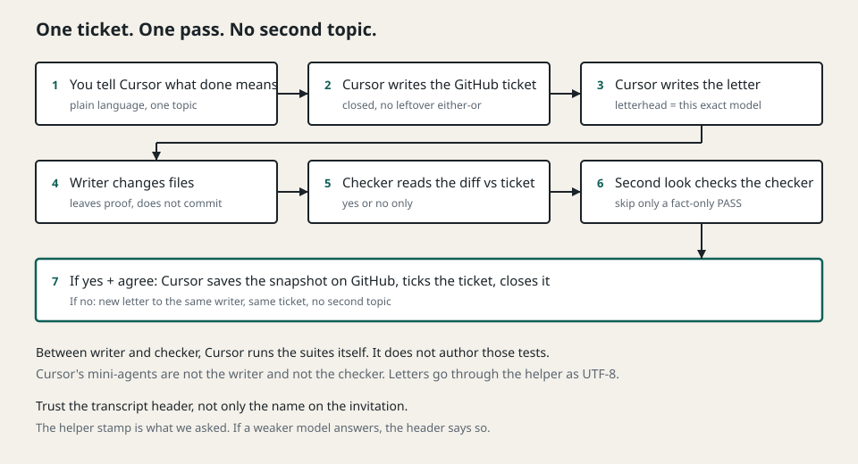
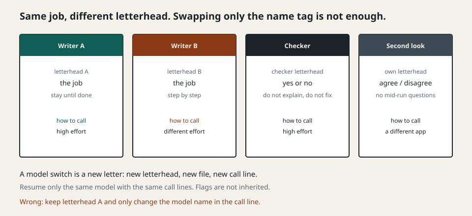
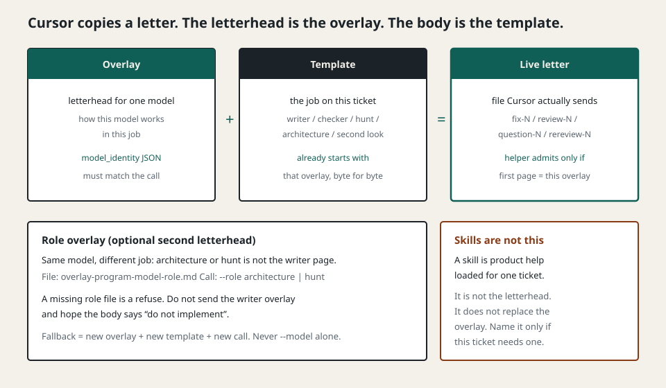
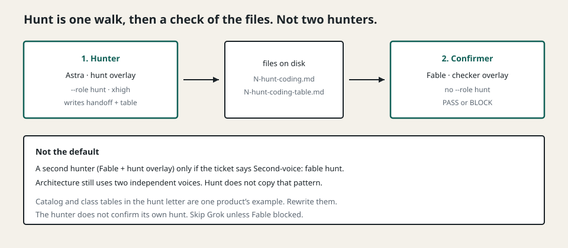
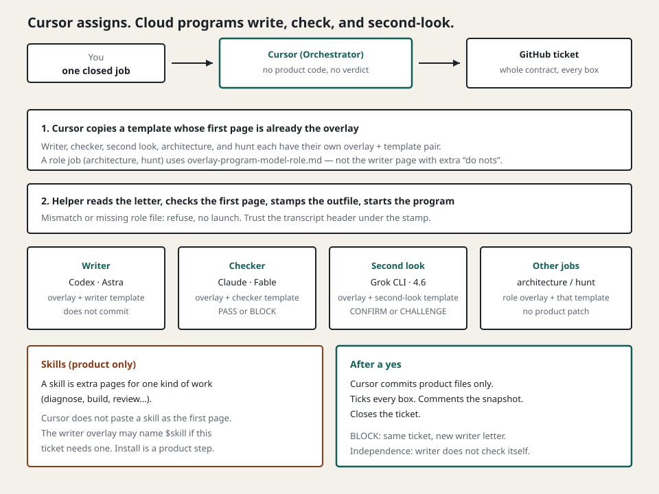
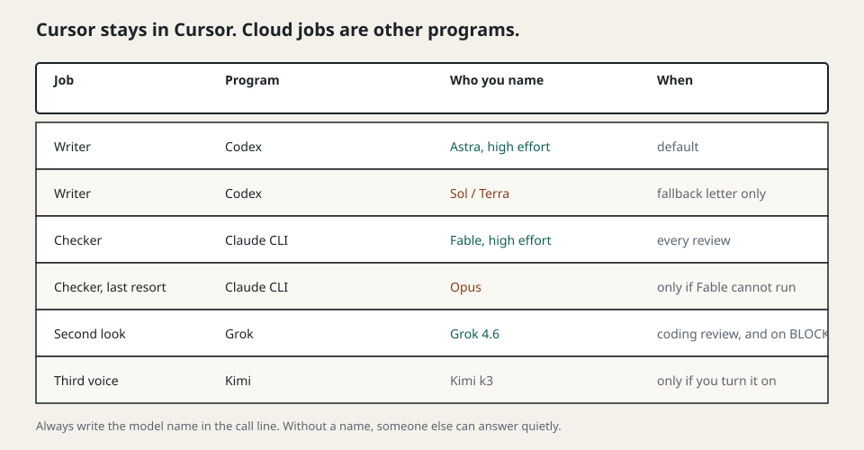
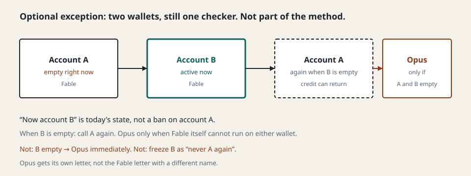
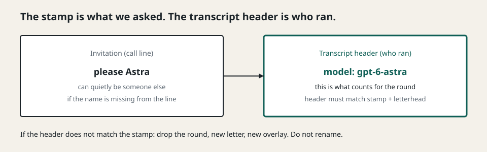

# How to orchestrate cloud coders

This repository is a **production-usable** description of how to use
**Cursor** to steer several **cloud coders** so that real development
work gets done. You can run this loop as written.

It is **production-near**, not a complete dump of every live pin, wallet
name, or in-flight ticket. Enough is here for a human or an AI to
build **its own** version of the loop (overlays, templates, helper,
seats) without copying a private product tree.

You talk to Cursor. Cursor does not write the product. Cursor writes a
GitHub ticket, writes a letter to a cloud model, and starts the right
program on the machine. It only commits after the checker has said yes,
and after the second look has agreed when that seat ran.

The letters that actually go to the models stay in English, because
that is the language the programs expect. License: [MIT](LICENSE).
It has line drawings, a lot of prose, and copy-paste files with
**no tokens and no home paths**.

The pictures still help. Read the paragraphs around them; the pictures
alone are not the guide.

These iron rules come first on purpose. If a later section is handy and
a rule here is strict, the rule wins.

---

## Iron rules

These rules do not bend for speed, for a “small” change, or for a model
that could do two jobs. Mixing seats is how this loop stops being a
loop.

1. **The session that is Orchestrator never implements coding.** That
   Cursor chat does not write product code, does not *author* tests,
   and does not write throwaway probes “just to see”. It *runs* the
   test suite later, as verification. Implementation leaves this
   session over a letter and a CLI. If the orchestrator session starts
   editing the product, the writer seat has already collapsed into the
   assigner.

2. **That same session never issues a review verdict.** It does not
   write PASS or BLOCK. It does not write CONFIRM or CHALLENGE. Those
   words belong to the checker and the second look, in their own
   programs, in files on disk. A verdict typed in the Cursor chat is
   not a review. It is the assigner grading its own homework.

3. **Cursor’s own mini-agents and Tasks are never the writer and never
   the checker.** They live and die inside the orchestrator session.
   They do not leave a letter, a stamp, or an independent transcript.
   Cloud jobs leave Cursor over stdin and stdout.

4. **Four seats, four processes. Nobody does someone else’s job.**
   The seats are Orchestrator (this Cursor session), Writer, Checker,
   and Second look. You are the human, not a seat. GitHub holds the
   ticket; it is not a seat. Same model family on two seats is allowed
   only when the *task* is different and the *process* is different
   (Grok as Orchestrator and Grok as second look is that case). The
   orchestrator session must not perform a review verdict.

5. **The writer never commits, never pushes, and never starts a second
   issue.** One linked ticket per dispatch. Findings on that ticket
   stay on it. Commit and close belong to Cursor, and only after a
   yes.

6. **The checker never fixes.** PASS or BLOCK only. A checker that
   starts editing is a second writer, and then nobody is checking.

7. **The second look never fixes, and it never shares the orchestrator
   session.** CONFIRM or CHALLENGE only. It is a different program on
   purpose. It judges the review, not the diff for a second time as a
   secret writer.

8. **One open change on the tree.** Do not start the next ticket while
   this one is still uncommitted work. Do not open a second topic to
   dodge a BLOCK.

9. **The GitHub ticket is the contract.** Every rule the checker must
   enforce is a checkbox on that ticket. The checker letter gets the
   **whole** closed ticket, including every done-box. A shorter pin is
   a defect. An open “A or B” on the ticket means the writer does not
   start.

10. **Always name the model on the call. Always put that model’s
    overlay at the top of the letter.** A missing model name can
    silently pick a weaker model. A swapped name with the old first
    page is not a fallback. The helper must refuse a letter whose
    first page is not that model’s overlay.

11. **A fallback is a new letter.** New first page, new file, new
    flags, new output path. Never keep Astra’s page and only change
    `--model`. Never start the checker on Opus.

12. **The model that just wrote a round does not review that round.
    The model that just reviewed it does not write the fix.**
    Independence is a hard refuse, not a preference.

13. **Do not park a disagreement.** If two cloud voices disagree, ask
    the human in the Cursor chat. Do not hide the split in a notes
    file and continue.

14. **Believe the transcript header, not the invitation.** The helper
    stamp (first line of the saved file) is what we *asked*: seat,
    program, model. It must match the letterhead. Who actually ran is
    the program’s own transcript header *under* that stamp. A broken
    Codex cache can still answer as Terra after we asked for Astra.
    If the header disagrees with the stamp, throw the round away.
    New letter. New overlay. Do not rename the old file.

15. **Never trust a writer or checker self-report.** Cursor *runs*
    the suites and guards itself. That is not the writer seat. A
    review voice looking is not a substitute for that run.

16. **State lives on disk and on GitHub, not in the chat.** After a
    restart, resume from the files. Do not invent the queue from
    memory. After two failed attempts at the same approach: stop and
    ask.

17. **After a yes: product files only.** Tick every done-box, comment
    the snapshot, close the ticket. Loop files and Cursor settings do
    not go into that commit. Do not open or merge a pull request
    unless the human says so.

If a round has already broken one of these, stop. Do not patch the
break by doing a second forbidden job “just this once”. Ask the human,
then start a clean letter from the right seat.

---

## What this is, in one sitting

Imagine a small workshop.

You decide *what* should exist. Cursor is the floor manager. GitHub is
the clipboard on the wall: one ticket, one job, no leftover “A or B”.
A **writer** in the cloud changes the files. A **checker** in the cloud
reads the ticket and the diff and says yes or no. A **second look**
reads the checker, not so it can rewrite the product, but so a second
independent voice can agree or disagree.

Cursor’s own mini-agents are not the writer and not the checker. If
Cursor writes the code *and* judges the code, you no longer have a
second pair of eyes. That is the whole point of this setup.

The four *seats* are Cursor (Orchestrator), Writer, Checker, and
Second look. You and GitHub in the top row are not seats.

---

## Which cloud coders we use, and why each one has that job

A “cloud coder” here is not a Cursor chat. It is a **program on your
machine** that talks to a hosted model. Cursor stays in Cursor. The
jobs leave Cursor over stdin and stdout.

We keep four seats, and we do not mix them. You are the human above
those seats, not a fifth seat.

### You

You say what to build, in one closed decision. You are the only person
who may reopen a fork (“do we do A or B?”). If two cloud voices
disagree, Cursor must ask you in the Cursor chat. It must not park the
disagreement in a notes file and keep going.

### Cursor, the assigner

Cursor (in our loop: Grok 4.6 inside a Cursor session) is the
**orchestrator**. That word only means: this session assigns work. It
writes the GitHub ticket. It writes the letter to each model. It starts
the programs. It runs tests itself so it does not have to trust the
writer’s self-report. After a yes, it commits, ticks the boxes on the
ticket, comments the snapshot, and closes the ticket.

Cursor never writes product code. Cursor never says PASS or BLOCK.
Cursor never says CONFIRM or CHALLENGE. Those words belong to other
seats. If they appear in the Cursor chat, the round is already mixed.

### The writer: Codex, model Astra

The writer is Codex (`codex exec`) with the model **gpt-6-astra** at
high effort (`xhigh`).

Astra’s job is to implement **one** GitHub issue: product code, focused
tests, docs, and a handoff file. It does not commit. It does not push.
It does not start a second issue. It is told to stay until the ticket’s
done-list is actually met, not to stop at a first patch or a plan.

We use Astra for almost every round that needs judgment: new behavior,
a semantic proof, or any fix after a checker said no. Architecture
*questions* are a different letter (Fable and Astra as architecture
voices, not as writer). Architecture *implementation* after a closed
pick is a writer letter, still Astra.
Astra is expensive on purpose. A cheaper model that quietly takes the
job will not fail loudly. It will just need more rounds to converge.

### The checker: Claude Fable

The checker is Claude, model **claude-fable-5-1**, at high effort
(`xhigh`). One checker. One job.

Fable’s job is to read the **whole** closed GitHub ticket and the
uncommitted diff, and to answer **PASS** or **BLOCK**. It does not
fix anything. It does not start a long test suite. It must cite the
round diff or a command result that is already on disk. It must not
echo or explain its inner reasoning.

We use Fable because the writer and the checker must be different
families. If the same kind of model writes and then reviews, the
review is not independent. Fable is the default reviewer for a single
ticket and also for a later bundle review.

### The last-resort checker: Opus

Opus is still Claude, still a checker, still PASS or BLOCK, still
does not fix. It is **not** the starting checker. Call Opus only when
Fable cannot run (the account is empty, the model is down). Opus gets
its own letter. You do not keep a Fable first page and only change
the model name.

Two Claude logins on our machine (`sub1` / `sub2`) are a **local
wallet exception**, not part of the method. They are the same Fable
checker with two subscriptions. Skip that until you actually have two
wallets. Details live only in [`examples/dispatch.md`](examples/dispatch.md).

### The second look: Grok 4.6 on the Grok CLI

After a genuine coding review, a second program — the Grok CLI, model
**grok-4.6** — reads the checker’s verdict against the same round and
the same closed ticket. It answers **CONFIRM** or **CHALLENGE**. It
does not fix product code. It does not sit in the Cursor chat. It is
a different process on purpose, so the assigner and the second look
do not share a session.

This second look is conditional. Run it when there was real design or
new logic. Skip it when the checker **PASS**ed a fact-only round that
only re-checked something already diagnosed, and write that skip on
the close comment. When unsure, run it. A **BLOCK**, or any remaining
doubt, always gets this voice *before* the next writer letter. If the
second look CONFIRMs the BLOCK, the next letter goes to the writer on
the same ticket. If it CHALLENGEs the BLOCK, ask the human. Do not
park that split.

### The optional third voice: Kimi k3

Kimi (`kimi-k3`) is an extra independent second look. It is off unless
you turn it on. If Grok and Kimi both run, each letter must say the
other is running in parallel, so neither waits for the other.

### Why Cursor mini-agents are not on this list

Cursor can spawn helpers inside the chat. We do not use them as writer
or checker. The cloud jobs have to leave a file on disk: a letter, a
transcript, a stamp that names the model. A mini-agent that lives and
dies inside the Cursor session does not leave that trail, and it is
not independent of the assigner.

---

## How you steer them

Steering is not a vibe in the Cursor chat. Steering is three things
that have to match: the **ticket**, the **first page of the letter**,
and the **call line**.

### 1. One ticket, one closed decision

Say one thing. Cursor puts it on GitHub. The ticket is the contract
the checker will judge. Every rule the checker must enforce is a
checkbox on that ticket, not only a sentence in a private notes file.

The ticket must not still contain “A or B”. If a decision is open,
do not start the writer. Close the fork on GitHub first. Cursor may
add loop pins to the letter (which model, which HEAD, do not commit).
The letter must not contradict the ticket.

If the checker later sees a shorter pin than the ticket, that is a
defect. Paste the **whole** closed ticket into the checker letter,
including every done checkbox. Do not paraphrase.

### 2. A letter whose first page is only for that model

Each model has a small file called an **overlay** (think: letterhead).
The letter that goes to the model must **start** with that file,
byte for byte. The overlay names the model in a `model_identity`
comment and tells it how to behave in this job.

- Astra’s first page says: stay until the job is done.
- Sol / Terra’s first page is more step-by-step, with a different
  effort. It is not Astra’s page with the name swapped.
- Fable’s first page says: PASS or BLOCK, do not fix, do not explain
  your inner work.
- Opus’s first page is its own checker page, not Fable’s.
- Grok 4.6’s first page says: CONFIRM or CHALLENGE, no questions in
  the middle.
- Grok 4.5 and Kimi k2.5 are different pages again.

**A model switch is a new letter.** New first page, new file, new call
line. The helper in this repo refuses a letter whose first page is not
exactly that model’s overlay.

Wrong: keep Astra’s first page and only change the model name in the
call. The model will still be steered as Astra, or the helper will
refuse, or a weaker model will answer and you will only see it later
in the transcript header.

### Overlay, template, and skill (three different files)

The **overlay** is the letterhead: how *this* model behaves in *this*
kind of job. Astra’s writer page says stay until done. Fable’s checker
page says PASS or BLOCK and do not fix. Those are not interchangeable
covers on the same body.

The **template** is the job text for that seat. On disk it **already
starts** with that overlay, byte for byte. Cursor copies the template
to a live letter (`fix-…`, `review-…`, `rereview-…`, `question-…`),
fills the ticket number and the evidence paths, and sends that file.
It does not invent a first page in the chat.

A **role overlay** is a second letterhead for the same model on a
different job: architecture questions, or a hunt over a large tree.
The call names `--role architecture` or `--role hunt`. The helper
looks up `overlay-<program>-<model>-<role>.md`. If that file is
missing, the helper refuses. Do not send the writer overlay and hope
the body says “do not implement”. That mix is how an architecture
letter still tries to patch the product.

**Hunt, as this loop actually runs it:** one hunter, then a check of
the files. Astra gets the hunt overlay (`--role hunt`) and writes a
handoff plus a table. Fable does **not** walk the tree again. Fable
gets the **checker** overlay (no `--role hunt`) and says PASS or
BLOCK on those artifacts. Architecture still uses two independent
voices; hunt does not copy that pattern unless the ticket names
`Second-voice: fable hunt`.

The hunt templates ship a coverage catalog and a defect-class table
from **one real product**. Rewrite both for the tree you are hunting
before the first hunt letter. Empty class fields mean every default
class, not only fail-closed wiring.

A **skill** is not a letterhead. It is optional product help for one
ticket (diagnose, build, review, and so on). Cursor does not paste a
skill as the first page. The writer overlay may *name* a skill when
this ticket needs one. Installing that skill is a product step on
the writer process, after the overlay, not instead of it.

Cursor stays the assigner. It writes the ticket, copies the matching
template, runs the helper, and waits for files on disk. The cloud
programs are other processes. Mini-agents inside the Cursor chat are
still not on this picture.

### 3. A call that names the program, the model, and the job

Cursor stays in Cursor. The cloud jobs are other programs:

| Job | Program on the machine | Name you write in the call | When |
|---|---|---|---|
| Writer | `codex` | `gpt-6-astra`, effort `xhigh` | almost always |
| Writer fallback | `codex` | `gpt-5.6-sol` or `gpt-5.6-terra` | only a separate letter |
| Checker | Claude CLI | `claude-fable-5-1`, effort `xhigh` | every review |
| Last-resort checker | Claude CLI | `opus`, effort `xhigh` | only when Fable cannot run |
| Second look | `grok` | `grok-4.6` | after a genuine coding review, and on every BLOCK |
| Third voice | `kimi` | `kimi-k3` | only if you turn it on |

Always write the model name in the call. If you omit it, a weaker
model can answer and you will not see that in the invitation. For
Codex this is worse than it sounds: a broken models-cache load can
silently fall back to Terra at medium effort, with no error on the
call. The helper stamp records what you asked. The transcript header
under it is who ran. Trust the header.

The helper `scripts/pipe.py` is the teaching copy of that call. It
feeds the letter as UTF-8, checks the first page, writes a JSON stamp,
then the program’s output. Live call shapes:
[`examples/dispatch.md`](examples/dispatch.md).

Resume only the **same** model, with the **same** flags. Codex does
not remember sandbox or effort on resume. If you omit them, the writer
wakes up in a sandbox that cannot run tests.

### 4. After yes, Cursor saves. After no, same ticket, new letter

If the checker says **BLOCK**: run the second look on that BLOCK.
When the second look CONFIRMs it, send a new letter to the same
writer family on the **same** ticket. Not a second topic. Not a
second open change on the tree. When the second look CHALLENGEs the
BLOCK, ask the human.

If the checker says **PASS**, and the second look (when it ran)
CONFIRMs, Cursor commits **product files only**. It ticks every
done-box on the ticket. It comments the snapshot id. It closes the
ticket. Loop files and Cursor settings do not go into that commit.

---

## Fallbacks: how they work, and what they need

A fallback is not “the same letter, different `--model`”. A fallback
is a different person doing a similar job. It needs its own first
page, its own letter file, its own call flags, and its own output
file.

The writer fallback is Sol or Terra. The checker fallback is Opus.
Two Claude wallets are not a fallback. They are an optional local
exception, drawn only at the end of this section.

### Writer fallback (Sol, then Terra)

Use Sol or Terra only when the work is mechanical: re-render something
already defined, a rename with no behavior change, formatting. Any
new logic, any semantic red-first proof, any architecture, and every
fix after BLOCK or CHALLENGE stays on Astra. When unsure, use Astra.

What you need for a writer fallback:

1. The overlay file for that model
   (`overlay-codex-gpt-5.6-sol.md` or `overlay-codex-gpt-5.6-terra.md`).
2. A **new** letter that starts with that overlay. Do not reuse the
   Astra persistence language. Sol and Terra want named entry points,
   named tests, and step-by-step work.
3. A call that names that model and **its** effort (`high` for Sol,
   `medium` for Terra), not Astra `xhigh`.
4. A new output file. Do not append to the Astra transcript.

Resume a Sol session only as Sol, with the Sol letter and the Sol
flags. Switching to Astra is a fresh call.

### Checker fallback (Opus)

The method has one checker: Fable. The fallback is Opus, only when
Fable cannot run. Never start on Opus.

What you need:

1. The Opus overlay and an Opus letter. A Fable letter with
   `--model opus` is not a fallback. It is a mixed identity.
2. A call that names `opus` and effort `xhigh`.
3. A new output file.

Rotating two Claude subscriptions when one wallet is empty is **not**
a second checker and **not** part of this method. If you happen to
have that problem, it is a local exception: still Fable, still the
same overlay, still the same letter, a different login binary. Do not
jump to Opus because one wallet is empty.

That drawing is only the wallet case. Account A and account B are
the same checker. Opus is still last, and only when Fable itself
cannot run. Our machine’s names for those binaries are in
[`examples/dispatch.md`](examples/dispatch.md). Skip the drawing if
you have one Claude login.

### Second-look fallback (Grok 4.5, Kimi k2.5)

Grok 4.6 and Grok 4.5 are different letters. Kimi k3 and Kimi k2.5
are different letters. Do not keep a 4.6 letter and only change
`--model`. Each older model has its own overlay in
`examples/overlays/`.

### What every fallback needs, in one list

- A matching overlay file on disk.
- A letter that **starts** with that overlay.
- A call that names that model exactly once.
- A new output path.
- The helper stamp matching the letterhead (what we asked).
- The transcript header matching that stamp (who ran).
- If the header disagrees: throw the round away. New letter. New
  overlay. Do not rename the old file and pretend the other model ran.

The call line and the helper stamp are the invitation. The transcript
header under the stamp is who answered. Believe the header.

---

## How the mechanics work here

This section is the moving workshop, not the poster. Some of it is
already how every round runs. Some of it is decided and being wired
into the helper. The loop is still this loop while those parts land.
Do not wait for the last guard before you keep the seats apart.

### What already runs, every round

You talk to Cursor. Cursor is the orchestrator session. The product
lives in a git checkout on a Linux machine. Dispatch runs from the
repo root. There are no provider HTTP APIs in this path, and no
Cursor Task or subagent standing in for Codex, Fable, or the Grok CLI.

State does not live in the chat. It lives in two places:

- **GitHub issues** are the board. Open work, status, and the closed
  contract live there. There is no second product backlog.
- A gitignored folder next to the product (we call it `.devloop/`)
  holds the letters, transcripts, stamps, and a small now/next file.
  After a context summary or a restart, Cursor reads that folder
  rather than inventing the queue from memory.

A round looks like this:

1. Cursor writes or edits the GitHub issue until the decision is
   closed. Pick, seam, caller, lifetime, and a named way the old
   path must fail are on the ticket. A leftover “vs” in the
   done-list means the writer must not start.
2. Cursor copies a template, puts the matching overlay at the top,
   fills the issue number, and pastes the whole ticket into the
   checker letter.
3. The board card moves to In Progress **before** the writer starts.
   Do not dispatch while the card is still Todo.
4. The writer runs through the helper. One issue. Astra unless the
   work is purely mechanical. The writer stops at a handoff file. It
   does not commit.
5. Cursor verifies independently: focused tests, then the wider
   suite and the repo guards. It does not trust the writer’s
   self-report. It does not skip this because a review voice already
   looked.
6. The board card moves to In Review. Fable reads the diff against
   the ticket.
7. On a genuine coding review, and on every BLOCK, Grok (and only if
   you turned it on, Kimi) re-reads the checker. A fact-only PASS may
   skip this seat; record the skip on the close comment.
   CONFIRM of a PASS goes on to commit. CONFIRM of a BLOCK goes back
   to the writer as a new round of the **same** ticket, same flags.
   CHALLENGE goes back to the checker, or Cursor asks you. Cursor
   does not park that disagreement.
8. Only after PASS, and CONFIRM when the second look ran, and green
   verification: Cursor commits product files, ticks every done-box,
   comments the snapshot, and closes the ticket.

Architecture questions do **not** go to the writer first. Cursor
sends the same question to Fable and to Astra **as an architecture
voice** (a different letter, not an implement letter) in parallel,
with no coordination between them. That Astra call does not edit
product files. If they agree, that agreement is written on the
GitHub issue and the next *writer* letter builds exactly that. If
they disagree, Cursor asks you in the chat. Do not start the next
child on that split.

Host installation is a fifth *task*, not a fifth review seat. Cursor
specifies it and dispatches the Grok CLI. The Cursor session does not
install software on hosts.

There is only one open change on the tree. Work lands on an
integration branch and is verified there. Cursor does not open or
merge a pull request unless you say so.

### What the helper already enforces in this teaching repo

`scripts/pipe.py` is the small portable helper. It does not import
the product. It does not contain tokens.

Before it starts a program it:

- reads the letter as UTF-8 (or UTF-16 with a BOM, then rewrites
  UTF-8),
- demands exactly one explicit model on the call,
- loads `overlay-<program>-<model>.md`,
- refuses unless the letter starts with that overlay,
- writes a one-line JSON stamp (`seat`, `harness`, `model`) as the
  first line of the output — that stamp is the invitation, copied
  from the call, not a discovery of who ran,
- then writes the program’s output under that stamp. The transcript
  header in that output is who ran.

If the overlay is missing, or the first page does not match, the
program is not started. That is already enough to stop the common
failure: keep Astra’s page, change the model flag, and believe the
new model was steered.

Copy the overlays from `examples/overlays/` into the product as
`.devloop/overlay-<program>-<model>.md`. The helper looks there, or
in `LOOP_OVERLAY_DIR`.

### What is decided and being wired next

The product loop is tightening the same idea so a letter cannot
wear the wrong job, not only the wrong model. Treat the following as
the mechanics we are implementing, not as optional color.

**Seats and roles.** A call names a seat: `coding`, `review`,
`review_of_review`, or `bundle_review`. A role overlay can further
say `architecture` or `kreuz`. The six role names are settled.
Kreuz is a cross-check role for architecture; it is not a second
writer. Bundle review is Fable looking at a whole integration bundle,
not at a single child ticket.

**Admission on the letterhead.** Each base overlay is supposed to
carry a `loop_seats` comment: which jobs that model may take when you
do not pass `--role`. A missing comment, or a seat that is not on the
list, should refuse **before** launch. A foreign job needs an explicit
`--role` and a matching `overlay-<program>-<model>-<role>.md`. A
missing role file should refuse. It should not silently fall back to
the base page.

**A log of who was admitted.** Each accepted call should leave a
steering event on disk, and every output file should begin with the
provenance record for that call. A refused preparation should not
advance the log. The transcript header must still confirm the model.
The log records what we asked; the header records who answered.

**Failover across families, in a fixed order.** Today, writer
fallback is Sol/Terra (same program, weaker model) and checker
fallback is Opus when Fable cannot run. The next piece is a single
exhaustion-and-outage order that can also move a job to another
family: same seat first, then cross. Independence stays a hard
refuse: the model that just wrote the round must not review that
round, and the model that just reviewed must not then write the
fix. Grok and Kimi may take foreign seats only when that rule still
holds. Terra stays out of architecture. This cross-family failover
is **decided** and is **not** the live default until a later
loop-only change lands. Until it does, do not improvise a
Fable-as-writer round by hand unless a pin on disk says so.

**Second-look file names.** A review-of-review letter should be
named `rereview-…`. That stem is being enforced on the helper so a
checker letter cannot be fed to the second look by accident.

**Calibration.** An optional on-disk pack can add a short verdict
addendum after the overlay for a matching model identity. A missing
or unmatched pack leaves the letter unchanged. A broken pack should
refuse. This is operator-owned, not something the product writes
during a round.

Until those guards are live in the product helper, behave as if they
already were. The teaching `pipe.py` already refuses a mismatched
first page. The rest is the same habit: new job, new letter, new
overlay, new call.

---

## Copy this into a product repo

1. Put `scripts/pipe.py` and `scripts/letter.py` on the Linux machine
   that runs Cursor.
2. Put the files in `examples/overlays/` next to your work as
   `.devloop/overlay-<program>-<model>.md` and, for architecture or
   hunt, `overlay-<program>-<model>-<role>.md`.
3. Copy a template from `examples/templates/` (already starts with
   that overlay). Or run `python scripts/letter.py new --harness …`.
   Fill the ticket number. Paste the **whole** closed GitHub ticket
   into the checker letter.
4. Call through `pipe.py` so the first page is checked and the stamp
   is written. Role jobs pass `--role architecture` or `--role hunt`.

Live call shapes: [`examples/dispatch.md`](examples/dispatch.md).

What this copy **does not** include: API keys, tokens, personal home
paths, a product-specific admit log. Your own product can add a
stricter gate; the helper here already refuses a missing or
mismatched first page.

The [iron rules](#iron-rules) at the top of this file are the ones that
must not break. If a copy-paste round would violate one of them, do not
start the call.
